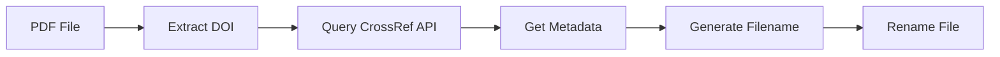

# Documentation
{: .no_toc }

Complete guide to using NameMyPdf.
{: .fs-6 .fw-300 }

---

## Table of Contents
{: .no_toc .text-delta }

1. TOC
{:toc}

---

## Basic Usage

### Drag and Drop

The simplest way to use NameMyPdf:

1. Open your **Applications** folder
2. Locate PDF files you want to rename
3. **Drag and drop** them onto the NameMyPdf.app icon
4. Watch as they're automatically renamed!

A progress window will show you what's happening. The app will quit automatically when done.

---

## How It Works

NameMyPdf follows this process for each PDF:



1. **Scans** the first 2 pages of the PDF for DOI information
2. **Extracts** the DOI using pattern matching
3. **Queries** the CrossRef API for metadata (author, year, title)
4. **Generates** a clean filename: `Author Year - Title.pdf`
5. **Renames** the file in place

---

## Filename Format

By default, files are renamed as:

```
Author Year - Title.pdf
```

**Examples:**

| Original | Renamed |
|:---------|:--------|
| `paper.pdf` | `Smith 2023 - Machine Learning Applications.pdf` |
| `download.pdf` | `Johnson 2024 - Neural Networks Deep Learning.pdf` |
| `arxiv-1234.pdf` | `Chen 2023 - Computer Vision Transformers.pdf` |

---

## Configuration

NameMyPdf creates a configuration file at `~/.namemypdfrc` on first run.

### Configuration Options

Edit `~/.namemypdfrc` to customize:

```bash
# Email for CrossRef API (recommended for heavy usage)
CROSSREF_EMAIL=you@email.com

# Convert title to lowercase
DOWNCASE_TITLE=false

# Number of words from title to include
TITLE_WORDS=7

# Separator between title words
TITLE_WORD_SEPARATOR=" "

# Separator between author and year
AUTHOR_YEAR_SEPARATOR=" "

# Separator between year and title
YEAR_TITLE_SEPARATOR=" - "

# Use abbreviated title (first letter of each word)
USE_ABBR_TITLE=false

# Remove everything after colon in title
STRIP_TITLE_POST_COLON=true

# Enable debug logging
DEBUG=false
```

### Example Configurations

**Shorter filenames:**
```bash
TITLE_WORDS=4
STRIP_TITLE_POST_COLON=true
```
Result: `Smith 2023 - Machine Learning Applications.pdf`

**Abbreviated titles:**
```bash
USE_ABBR_TITLE=true
```
Result: `Smith 2023 - MLA.pdf`

**All lowercase:**
```bash
DOWNCASE_TITLE=true
```
Result: `smith 2023 - machine learning applications.pdf`

---

## Command-Line Usage

For terminal users, you can install the command-line tool.

### Installation

```bash
/Applications/NameMyPdf.app/Contents/Resources/install-cli.sh
```

This creates a `namemypdf` command in `/usr/local/bin`.

### Usage

```bash
# Single file
namemypdf paper.pdf

# Multiple files
namemypdf paper1.pdf paper2.pdf paper3.pdf

# All PDFs in current directory
namemypdf *.pdf

# All PDFs in a subdirectory
namemypdf ~/Downloads/*.pdf
```

### Uninstall CLI

```bash
sudo rm /usr/local/bin/namemypdf
```

---

## Logs and Debugging

NameMyPdf logs all activity to `~/Library/Logs/NameMyPdf.log`.

### View Recent Activity

```bash
tail ~/Library/Logs/NameMyPdf.log
```

### Watch Live Activity

```bash
tail -f ~/Library/Logs/NameMyPdf.log
```

### Enable Debug Mode

Edit `~/.namemypdfrc` and set:

```bash
DEBUG=true
```

This will show detailed information about:
- Tool paths (pdftotext, jq, curl)
- DOI extraction
- API responses
- Filename generation

---

## Troubleshooting

### No DOI Found

**Problem:** "No DOI found in [filename], skipping"

**Solutions:**
- Make sure the PDF actually contains DOI information
- DOI should be on the first 2 pages
- Some old papers don't have DOIs embedded in the PDF
- Try extracting the DOI manually and searching CrossRef

### Resource Not Found

**Problem:** "[DOI] --- not found"

**Solutions:**
- The DOI exists in the PDF but isn't in CrossRef database
- Try manually looking up the DOI at https://doi.org/
- The DOI might be malformed or incorrect

### Illegal Byte Sequence

**Problem:** Terminal errors about illegal byte sequences

**Solution:** This should be fixed in v0.9.19+. Update to the latest version.

### File Not Renamed

**Problem:** File already exists with the target name

**Solution:** NameMyPdf won't overwrite existing files. Rename or move the existing file first.

---

## FAQ

### Does this work with non-academic PDFs?

No, NameMyPdf specifically looks for DOI information, which is typically only in academic papers. Regular PDFs won't be renamed.

### Can I undo a rename?

Not automatically, but the log file shows what was renamed. You can manually rename files back if needed.

### Does it modify the PDF content?

No! NameMyPdf only renames the file. The PDF content is never modified.

### What if I have thousands of files?

NameMyPdf can handle batch processing. However, be courteous to the CrossRef API - consider adding your email to the config file if processing many files.

### Does it work offline?

No, NameMyPdf needs internet access to query the CrossRef API for metadata.

### Is my data sent anywhere?

Only the DOI is sent to the CrossRef API. No file contents or personal data is transmitted.

---

## Need More Help?

- 🐛 [Report a Bug](https://github.com/literatecomputing/name-my-pdf/issues)
- 💬 [Ask a Question](https://github.com/literatecomputing/name-my-pdf/discussions)
- 📧 Contact: Check the GitHub repository
