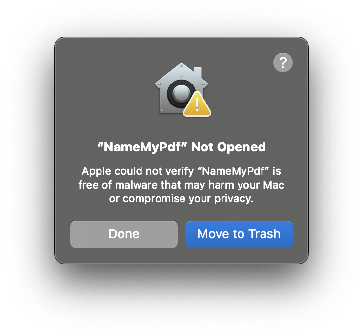
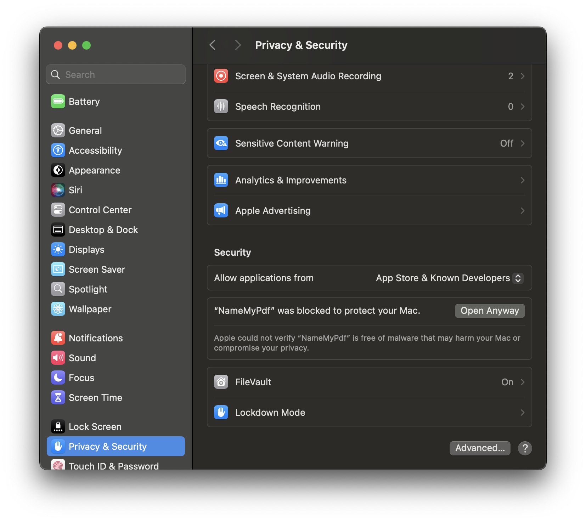
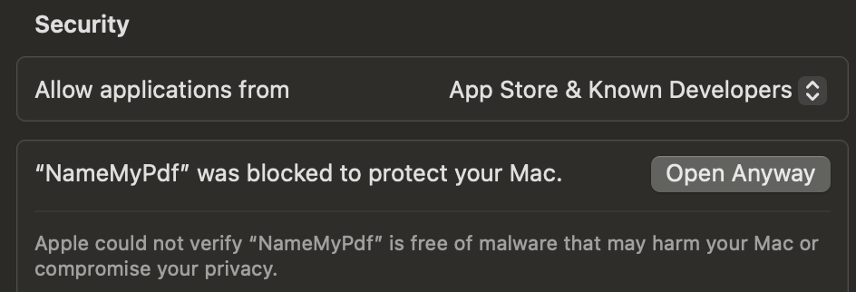
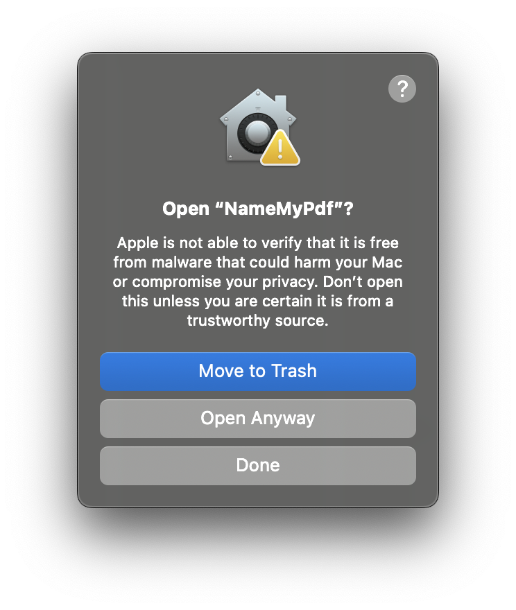

# Download NameMyPdf

{: .no_toc }

Get the latest version of NameMyPdf for macOS.
{: .fs-6 .fw-300 }

<!-- VERSION-UPDATE-START -->

[Download DMG (Recommended)](https://github.com/literatecomputing/name-my-pdf/releases/download/v0.9.55/NameMyPdf-v0.9.55.dmg){: .btn .btn-primary .btn-purple }
[Download ZIP](https://github.com/literatecomputing/name-my-pdf/releases/download/v0.9.55/NameMyPdf-v0.9.55.zip){: .btn }<!-- VERSION-UPDATE-END -->[View All Releases](https://github.com/literatecomputing/name-my-pdf/releases){: .btn }

## Latest Release Page at Github

<!-- VERSION-UPDATE-START -->
<div class="code-example" markdown="1">
**Current Version:** v0.9.55 ([release details](https://github.com/literatecomputing/name-my-pdf/releases/tag/v0.9.55))
**Last Updated:** October 17, 2025
</div>
<!-- VERSION-UPDATE-END -->

## Installation Instructions

1. **Download** the <!-- VERSION-UPDATE-START -->[DMG](https://github.com/literatecomputing/name-my-pdf/releases/download/v0.9.55/NameMyPdf-v0.9.55.dmg)<!-- VERSION-UPDATE-END -->

2. **Open** the DMG to mount the disk image
3. **Drag** `NameMyPdf.app` to the Applications folder icon.
4. **Eject** the disk image (or close the window)
5. **Launch** the app:

   - Find NameMyPdf in your Applications folder
   - Double-click or **Right-click** and select **"Open"** (first time only)
   - Get a scary warning. (It's OK. I promise.)

   {: width="250" }

   - Search for "Privacy and Security" System Settings

     {: width="250"}

6. **Scroll** to the bottom

   {: width="600"}

7. **Click Open Anyway**

   {: width="500"}

8. **Really Open Anyway** Now tell the **Finder** that it's OK to open it! (Don't Move to Trash!)

   {: width="250"}

{: .note }

> These shenanigans are required required the first time because the app is not code-signed. After the first launch, you can open it normally. I have spent the $100 to register as an Apple Developer; I estimate that it'll take about another $1000 worth of my time to figure out how to accomplish that.

## What's Included

✅ **Universal Binary** - Runs on both Intel and Apple Silicon Macs  
✅ **GUI App** - Drag-and-drop interface  
✅ **CLI Installer** - Optional command-line tool (see [Documentation](documentation.html#command-line-usage))

---

## System Requirements

| Requirement      | Details                           |
| :--------------- | :-------------------------------- |
| **OS**           | macOS 10.11 (El Capitan) or later |
| **Architecture** | Intel or Apple Silicon            |
| **Internet**     | Required for DOI metadata lookup  |
| **Dependencies** | None - everything is bundled!     |

---

## Troubleshooting

### App won't open / crashes immediately

Check the log file for errors:

```bash
cat ~/Library/Logs/NameMyPdf.log
```

If you see errors, please [open an issue](https://github.com/literatecomputing/name-my-pdf/issues) on GitHub.

---

## Need Help?

- 📖 Read the [Documentation]({{ site.baseurl }})
- 🐛 Report issues on [GitHub](https://github.com/literatecomputing/name-my-pdf/issues)

## Help Make This Better!

[Support NameMyPdf](/donate.html){: .btn .btn-green .fs-5 .mb-4 .mb-md-0 .mr-2 }
